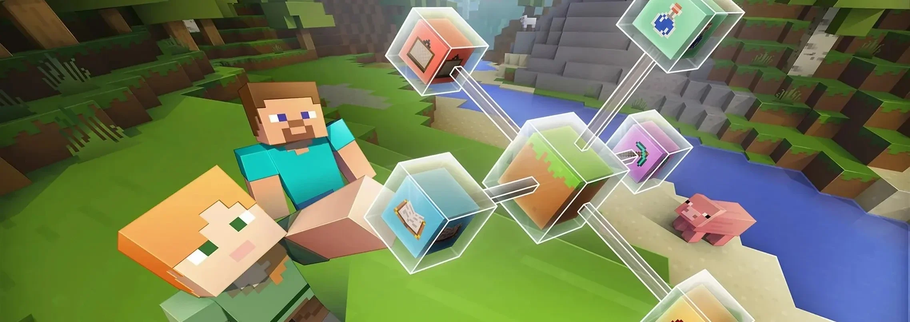

# Code Kid Code

[View Repository in GitHub Pages](https://github.com/jackpoletek/code-kid-code) <br>
[View Website](https://jackpoletek.github.io/code-kid-code/)

A fun and interactive coding platform for kids aged 7-9, teaching programming through Microsoft MakeCode and Minecraft Education.



## Table of Contents
- [The Why](#the-why)
- [UX/UI Design](#uxui-design)
- [Features](#features)
- [Technologies](#technologies)
- [Testing](#testing)
- [Deployment](#deployment)
- [Credits](#credits)

## The Why

### Problem
Many coding platforms for kids are either too abstract or lack engagement.

### Solution
Code Kid Code transforms programming fundamentals (loops, variables, conditions) into playful experiences using:
- [Minecraft Education](https://education.minecraft.net/)
- [Microsoft MakeCode](https://makecode.com/)

### Business Goals
- Increase course signups through clear CTAs
- Show parents how coding develops future skills
- Leverage Minecraft's popularity

### User Goals
| Audience       | Needs                                                                 |
|----------------|-----------------------------------------------------------------------|
| **Kids (7-9)** | Learn through play, build games, feel proud                           |
| **Parents**    | Find age-appropriate lessons with measurable progress                 |

## UX/UI Design

### Design Elements
- **Colours**:  
  Orange CTAs (energy) + Blue accents (trust)
- **Typography**:  
  [Poppins](https://fonts.google.com/specimen/Poppins) (headings) + [Roboto](https://fonts.google.com/specimen/Roboto) (body)

### Key Visuals
| Page       | Purpose                                 |
|------------|-----------------------------------------|
| **Home**   | Minecraft background for instant appeal |
| **Courses**| Icons for quick recognition             |
| **About**  | Gallery shows happy kids learning       |

### Wireframes - Figma()

#### Desktop
- Home_large screen_1039px <br>
(https://github.com/jackpoletek/code-kid-code/blob/main/assets/images/wireframes/Code%20Kid%20Code%20-%20Home_large%20screen_1039px.pdf)

- Courses_large screen_1039px <br>
(https://github.com/jackpoletek/code-kid-code/blob/main/assets/images/wireframes/Code%20Kid%20Code%20-%20Courses_large%20screen_1039px.pdf)

- About_large screen_1039px <br>
(https://github.com/jackpoletek/code-kid-code/blob/main/assets/images/wireframes/Code%20Kid%20Code%20-%20About_large%20screen_1039px.pdf)

#### Tablet
- Home_tablet_768px <br>
(https://github.com/jackpoletek/code-kid-code/blob/main/assets/images/wireframes/Code%20Kid%20Code%20-%20Home_tablet_768px.pdf)

- Courses_tablet_768px <br>
(https://github.com/jackpoletek/code-kid-code/blob/main/assets/images/wireframes/Code%20Kid%20Code%20-%20Courses_tablet_768px.pdf)

- About_tablet_768px <br>
(https://github.com/jackpoletek/code-kid-code/blob/main/assets/images/wireframes/Code%20Kid%20Code%20-%20About_tablet_768px.pdf)

#### Mobile
- Home_mobile_398px <br>
(https://github.com/jackpoletek/code-kid-code/blob/main/assets/images/wireframes/Code%20Kid%20Code%20-%20Home_mobile_398px.pdf)

- Courses_mobile_398px <br>
(https://github.com/jackpoletek/code-kid-code/blob/main/assets/images/wireframes/Code%20Kid%20Code%20-%20Courses_mobile_398px.pdf)

- About_mobile_398px <br>
(https://github.com/jackpoletek/code-kid-code/blob/main/assets/images/wireframes/Code%20Kid%20Code%20-%20About_mobile_398px.pdf)

[View all wireframes](https://github.com/jackpoletek/code-kid-code/tree/main/assets/images/wireframes)

## Features

### Current

**Responsive Navigation**
- Burger menu for mobile, sticky header

**Course Cards**  
- Instant recognition with platform icons
- Clear "Enroll Now" CTAs

**Trust-Building Pricing**   
- Teacher-student background image
- Simple 3-tier structure

**Parent-Friendly Signup**  
- Captures both parent and child details
- Age validation (7-9 only)

### Planned
- Parent progress dashboard
- Minecraft project showcase gallery
- Multilingual support

## Technologies
**Frontend**  
- [HTML5](https://en.wikipedia.org/wiki/HTML5)
- [CSS3](https://en.wikipedia.org/wiki/CSS)
- [Bootstrap](https://getbootstrap.com/)

**Assets**  
- Icons: [Font Awesome 6](https://fontawesome.com/)
- Images: [Pexels](https://pexels.com/)
- Fonts: [Google Fonts](https://fonts.google.com/)

## Testing
### Validation
- [W3C HTML Validator](https://validator.w3.org/) - 1 error

- index.html <br>
(https://github.com/jackpoletek/code-kid-code/blob/main/assets/images/validators-results/HTML_checker_index.jpg)

- courses.html <br>
(https://github.com/jackpoletek/code-kid-code/blob/main/assets/images/validators-results/HTML_checker_courses.jpg)

- about.html <br>
(https://github.com/jackpoletek/code-kid-code/blob/main/assets/images/validators-results/HTML_checker_about.jpg)

- [W3C CSS Validator](https://jigsaw.w3.org/css-validator/) - 0 errors <br>

(https://github.com/jackpoletek/code-kid-code/blob/main/assets/images/validators-results/CSS_checker.jpg)

### Performance
[Lighthouse Score]  

- index.html:
(https://github.com/jackpoletek/code-kid-code/blob/main/assets/images/lighthouse-test/Lighthouse_index.jpg)

- courses.html:
(https://github.com/jackpoletek/code-kid-code/blob/main/assets/images/lighthouse-test/Lighthouse_courses.jpg)

- about.html:
(https://github.com/jackpoletek/code-kid-code/blob/main/assets/images/lighthouse-test/Lighthouse_about.jpg)

### User Stories
| Test Case               | Result                              |
|-------------------------|-------------------------------------|
| Kid browses courses     | Engaged by Minecraft visuals        |
| Parent submits form     | Age validation works                |

## Deployment
1. **GitHub Pages**  
   ```bash
   git push origin main

## Aknowledgements:
I want to thank my mentor for all the ideas and my lecturer for the tips and showing a great deal of patience.
Also, big thanks to the City of Bristol College and Code Institute.
